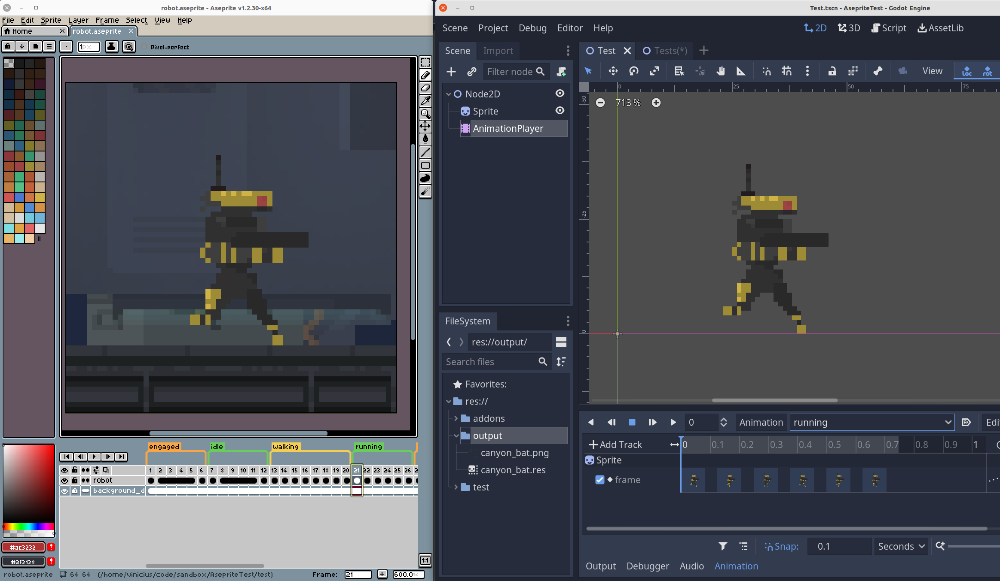
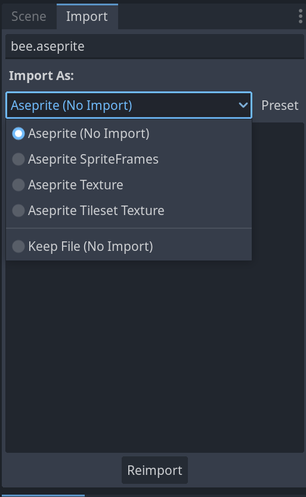
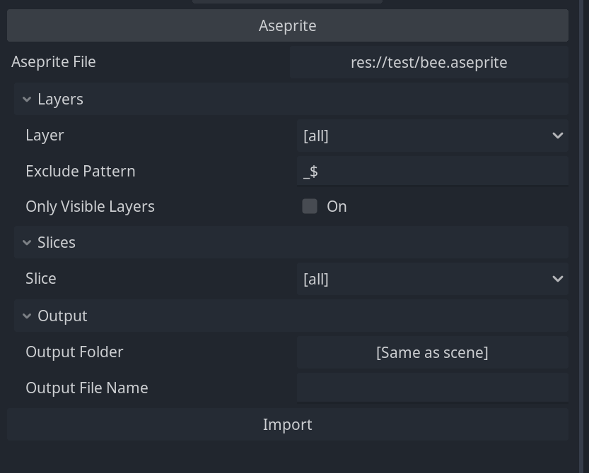
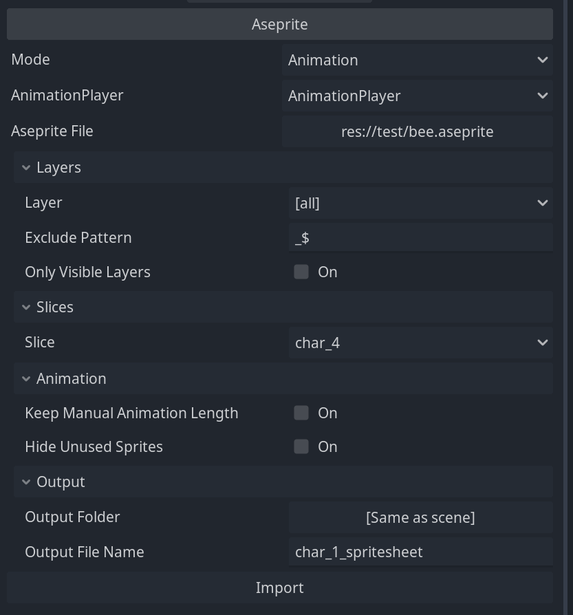
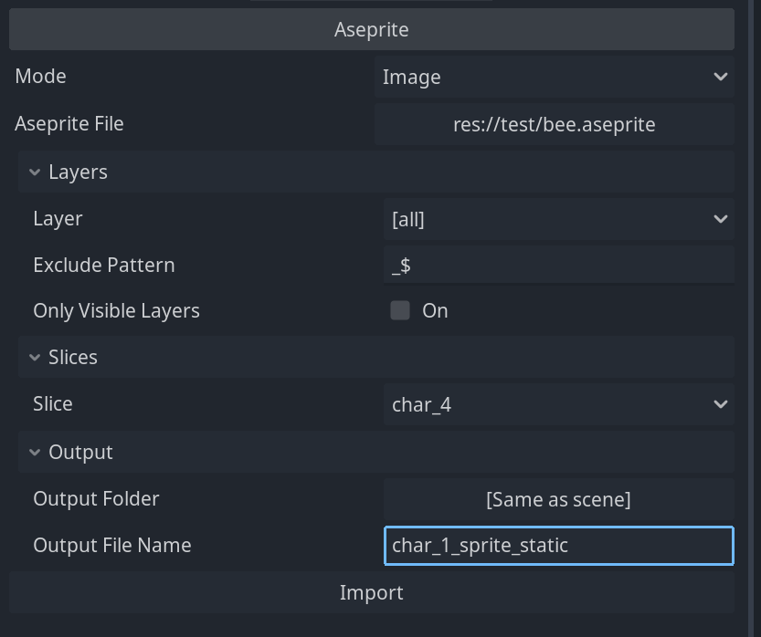
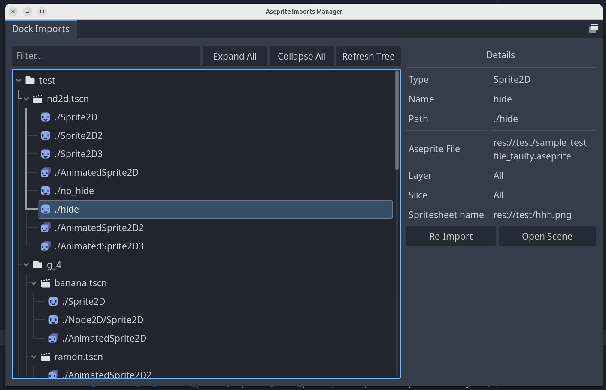

# Godot Aseprite Wizard (Godot 4)

Godot plugin to help import Aseprite animations to AnimationPlayers, AnimatedSprites 2D/3D and SpriteFrames.

_This branch supports Godot 4. For Godot 3 docs and code check the [godot_3](https://github.com/viniciusgerevini/godot-aseprite-wizard/tree/godot_3) branch. You can find more details about the differences between Godot 3 and Godot 4 on issue https://github.com/viniciusgerevini/godot-aseprite-wizard/issues/70._

_Check the screenshots folder for more examples._

## Index

- [Features](#features)
- [Installation and Configuration](#installation-and-configuration)
- [How to use](#how-to-use)
	- [Importers](#importers)
		- [SpriteFrames](#spriteframes-importer)
		- [Static Image](#static-image-importer)
		- [Tileset texture](#tileset-texture-importer)
	- [Inspector Docks](#inspector-docks)
 		- [AnimatedSprites](#animatedsprites)
		- [Sprites and TextureRect](#sprites-and-texturerect)
		- [Imports manager](#imports-manager) 
	- [Wizard Dock](#wizard-dock) 
- [F.A.Q. and limitations](#faq-and-limitations)
- [Known Issues](#known-issues)
- [Contact](#contact)

## Features

- Godot importer and inspector docks for easy import and re-import.
- Adds automatic importers:
	- Aseprite SpriteFrames: Use aseprite files as SpriteFrames resources.
	- Aseprite Texture: Use aseprite files as static images (only first frame is imported)
	- Aseprite Tileset Texture: Use aseprite files with tilemap layers as AtlasTexture which can be added directly to Godot's tileset creator.
- Inspector docks to manually import animations to:
	- AnimationPlayer (Sprite2D, Sprite3D and TextureRect).
	- AnimatedSprite2D/3D.
	- As standalone SpritesFrames resource.
- Supports Aseprite animation directions (forward, reverse, ping-pong, ping-pong reverse).
- Supports loopable and non-loopable animations via Aseprite repeat or tags.
- Separates each Aseprite Tag into animations. In case no tags are defined, imports everything as default animation.
- Filters out layers you don't want in the final animation using regex.
- Supports slices. Import only a region from your file.
- For AnimatedSprite
  - Creates SpriteFrames with Atlas Texture to be used in AnimatedSprites.
  - Converts Aseprite frame duration (defined in milliseconds) to Godot's animation FPS. This way you can create your animation with the right timing in Aseprite and it should work the same way in Godot.
  - Choose to export the Aseprite file as a single SpriteFrames resource or separate each layer in different resources.
  - Adds Aseprite file importer to Godot.
- AnimationPlayer
  - Adds and removes animation tracks without removing other existing tracks.
  - You are free to import multiple files to the same AnimationPlayer or import each layer to their own Sprite/TextureRect and AnimationPlayer.
  - Supports animation libraries.

Aseprite Wizard is only required during development. If you decide to not use it anymore, you can remove the plugin and all animations previously imported should keep working as expected.

## Installation and Configuration

Follow Godot [ installing plugins guide ]( https://docs.godotengine.org/en/stable/tutorials/plugins/editor/installing_plugins.html).

After installing the plugin, you need to make sure it's using the right Aseprite command. You can test the command by going to `Project > Tools > Aseprite Wizard > Config...`. If you get "command not found" instead of aseprite's version, you need to change the path to the Aseprite executable.

You can also change the path via editor settings: `Editor -> Editor Settings -> Aseprite`.

| Configuration           | Description |
| ----------------------- | ----------- |
| General > Command Path | Path to the aseprite executable. Default: `aseprite` |

For project specific configurations check `Project -> Project Settings -> General > Aseprite`.

| Configuration           | Description |
| ----------------------- | ----------- |
| Animation > Layer > Exclusion Pattern | Exclude layers with names matching this pattern (regex). This is the default value for new nodes. It can be changed or removed during the import. Default: not set |
| Animation > Layer > Only Include Visible Layers By Default | Default configuration for "only visible" in the docks. Default: false |
| Animation > Loop > Enabled | Enables animation loop by default. Default: `true` |
| Animation > Loop > Exception Prefix | Animations with this prefix are imported with opposite loop configuration. For example, if your default configuration is Loop = true, animations starting with `_` would have Loop = false. The prefix is removed from the animation name on import (i.e  `_death` > `death`). Default: `_` |
| Animation > Storage > Enable Metadata Removal on Export | Removes dock metadata from scene when exporting the project. Ensures no local info is shipped with the app. Default: `true` |
| Import > Cleanup > Remove Json File | Remove temporary `*.json` files generated during import. Default: `true` |
| Import > Cleanup > Automatically Hide Sprites Not In Animation | Default configuration for AnimationPlayer option to hide sprite when not in animation. Default: `false` |
| Import > Import Plugin > Default Automatic Importer | Which importer to use by default for aseprite files. Options: `No Import`, `SpriteFrames`, `Static Texture`, `Tileset Texture`. Default: `No Import` |

## How to use

_Check this video for usage examples:_ https://youtu.be/1W-CCbrzG_0

After activating the plugin, there are three different ways you can use it:

1. Using the automatic importers: Any file saved in the project will be automatically converted to the chosen resource. By default, the importer does not import anything. You can change the behaviour per file or choose the default importer via Project Settings.
1. Using the inspector docks: There will be a section called Aseprite in the inspector dock when selecting Sprite, TextureRect and AnimatedSprite nodes.
1. Using the wizard dock: You can open the wizard dock via `Project -> Tools -> Aseprite Wizard -> Spritesheet Wizard Dock...` menu. In this dock you can generate standalone SpriteFrames files from anywhere in your system.

### Importers

If you use the importer flow, any `*.ase` or `*.aseprite` file saved in the project folder will be automatically imported as a resource. The plugin enables 3 importers: `SpriteFrames`, `Static Image` and `Tileset Texture`.

You can choose which importer to use via the Import Dock. By default, aseprite files will use the "No import" option, which will show them in the filesytem dock, but won´t generate any resource. You can change the default importer behaviour via Project Settings.

The downside of using the importer flow is that you will need Aseprite available on every machine where you intend to run the project, even if you won't be working on the game art. If this is a problem to you, you should consider using the Import dock flow instead.

#### SpriteFrames importer

Aseprite files are imported as `SpriteFrames` resources and can be loaded to `AnimatedSprite` nodes directly.

Options:

| Field                   | Description |
| ----------------------- | ----------- |
| Output filename / prefix | Defines output filename. In case layers are split into multiple files, this is used as file prefix (e.g prefix_layer_name.res). If not set, the source filename is used.|
| Exclude layers matching pattern: | Do not export layers that match the pattern defined. i.e `_draft$` excludes all layers ending with `_draft`. Uses Godot's [Regex implementation](https://docs.godotengine.org/en/stable/classes/class_regex.html)  |
| Split layers in multiple resources: | If selected, each layer will be exported as a separated resource (e.g my_layer_1.res, layer_name_2.res, ...). If not selected, all layers will be merged and exported as a single resource file with the same base name as the source. |
| Only include visible layers | If selected it only includes in the image file the layers visible in Aseprite. If not selected, all layers are exported, regardless of visibility.|

#### Static image importer

Aseprite files are imported as `AtlasTexture` resources. Only the first frame will be visibile. A PNG file will be created alongside the AtlasTexture. You can choose to use either the aseprite and png file directly, as both will be kept updated.

Texture importer options:

| Field                   | Description |
| ----------------------- | ----------- |
| Exclude layers pattern: | Do not export layers that match the pattern defined. i.e `_draft$` excludes all layers ending with `_draft`. Uses Godot's [Regex implementation](https://docs.godotengine.org/en/stable/classes/class_regex.html)  |
| Only include visible layers | If selected it only includes in the image file the layers visible in Aseprite. If not selected, all layers are exported, regardless of visibility.|

#### Tileset texture importer

Aseprite 1.3 added [Tilemap support](https://www.aseprite.org/docs/tilemap/). You can create special layers which can then be exported as tilesets. The tileset importer will generate an image with the tiles from the aseprite file, which can be added to the Tileset editor in Godot.

Tileset importer options:

| Field                   | Description |
| ----------------------- | ----------- |
| Exclude layers pattern: | Do not export layers that match the pattern defined. i.e `_draft$` excludes all layers ending with `_draft`. Uses Godot's [Regex implementation](https://docs.godotengine.org/en/stable/classes/class_regex.html)  |
| Only include visible layers | If selected it only includes in the image file the layers visible in Aseprite. If not selected, all layers are exported, regardless of visibility.|
| Sheet type | Algorithm to create spritesheet. Options: columns, horizontal, vertical, packed. Default: columns|
| Sheet column | Only applied when sheet type is "columns". Defines the number of columns in the spritesheet. If "0", packed algorithm is used. Default: 12.

__Note:__ Like in the static image importer, a png file is generated alongside the resource. I noticed that sometimes when updating the aseprite file, Godot is keeping a cached version of the resource and not showing the update in the tileset editor. The same doesn't happen to the png file, so you might want to use it instead of the main .aseprite file.

### Inspector Docks

You can import animations directly to `AnimatedSprite` nodes and `AnimationPlayers` using the Inspector Dock. You can find the Aseprite section at the bottom of the Inspector Dock when selecting `AnimatedSprite2D`/`AnimatedSprite3D`/`Sprite2D`/`Sprite3D`/`TextureRect` nodes.

Animations imported via docks are only updated once you manually re-import them, giving more control on when imports happen and allowing others to run the project without having Aseprite installed.

#### AnimatedSprites

To import animations via the Import Dock:

1. Create an `AnimatedSprite2D` or `AnimatedSprite3D`node and select it in your scene.
1. With the node selected, look for the "Aseprite" section in the bottom part of the Inspector.
1. Fill up the fields and click import.

| Field                   | Description |
| ----------------------- | ----------- |
| Aseprite File: | (\*.aseprite or \*.ase) source file. |
| Layer: | Aseprite layer to be used in the animation. By default, all layers are included. |
| Exclude pattern: | Do not export layers that match the pattern defined. i.e `_draft$` excludes all layers ending with `_draft`. Uses Godot's [Regex implementation](https://docs.godotengine.org/en/stable/classes/class_regex.html) |
| Only visible layers | If selected, it only includes in the image file the layers visible in Aseprite. If not selected, all layers are exported, regardless of visibility.|
| Slice | Aseprite Slice to be used in the animation. By default, the whole file is used. |
| Output folder: | Folder to save the sprite sheet (png) file. Default: same as scene |
| Output file name | Output file name for the sprite sheet. In case the Layer option is used, this is used as the file prefix (e.g prefix_layer_name.res). If not set, the source file basename is used.|

Notes:
- A `SpriteFrames` resource will be generated and assigned to the AnimatedSprite. This resource is embedded in the scene and the spritesheet file will be created in the output folder.
- As opposed to the `AnimationPlayer` flow, a new `SpriteFrames` resource is generated on every import. This means any manual change will be lost after re-import.

#### Sprites and TextureRect

When working with `Sprite2D`, `Sprite3D` and `TextureRect` nodes, you have the option to import the file as a static image or load its animations to an `AnimationPlayer` node.

1. Create your node (`Sprite2D`, `Sprite3D`, `TextureRect`).
2. With the node selected, look for the "Aseprite" section in the bottom part of the Inspector dock.
3. Fill up the fields and click import.

##### Animation mode:

| Field                   | Description |
| ----------------------- | ----------- |
| Aseprite File | (\*.aseprite or \*.ase) source file. |
| Animation Player |AnimationPlayer node where animations should be added to.|
| Layer | Aseprite layer to be used in the animation. By default, all layers are included. |
| Exclude pattern | Do not export layers that match the pattern defined. i.e `_draft$` excludes all layers ending with `_draft`. Uses Godot's [Regex implementation](https://docs.godotengine.org/en/stable/classes/class_regex.html) |
| Only visible layers | If selected, it only includes in the image file the layers visible in Aseprite. If not selected, all layers are exported, regardless of visibility.|
| Slice | Aseprite Slice to be used in the animation. By default, the whole file is used. |
| Keep manual animation length | When this is active the animation length won't be adjusted if other properties were added and the resulting imported animation is shorter. Default: false. |
| Hide when unused| If active, this node will be set as hidden in every existing animation it is not part of. Default: false.|
| Output folder | Folder to save the sprite sheet (png) file. Default: same as scene |
| Output file name | Output file name for the sprite sheet. In case the Layer option is used, this is used as file prefix (e.g prefix_layer_name.res). If not set, the source file basename is used.|

Notes:
- The generated sprite sheet texture is set to the Sprite node and every tag in the Aseprite file will be inserted as an Animation into the selected AnimationPlayer.
- If the animation already exists in the AnimationPlayer, all existing tracks are kept. Only the required tracks for the Sprite animation will be changed.
- Loop configuration and animation length will be changed according to the Aseprite file. If you wish to keep a manually configured animation length, set the `Keep manual animation length` option.
- The plugin will never delete an Animation containing other tracks than the ones used by itself. In case the animation is removed from Aseprite, it will delete the track from the AnimationPlayer and only delete the animation in case there are no other tracks left.
- Animations are added to the global animation library by default. To define a library name, use the `library_name/animation_name` pattern on your Aseprite tags.

##### Image mode:

| Field                   | Description |
| ----------------------- | ----------- |
| Aseprite File | (\*.aseprite or \*.ase) source file. |
| Layer | Aseprite layer to be used in the animation. By default, all layers are included. |
| Exclude pattern | Do not export layers that match the pattern defined. i.e `_draft$` excludes all layers ending with `_draft`. Uses Godot's [Regex implementation](https://docs.godotengine.org/en/stable/classes/class_regex.html) |
| Only visible layers | If selected, it only includes in the image file the layers visible in Aseprite. If not selected, all layers are exported, regardless of visibility.|
| Slice | Aseprite Slice to be used in the animation. By default, the whole file is used. |
| Output folder | Folder to save the sprite sheet (png) file. Default: same as scene |
| Output file name | Output file name for the sprite sheet. In case the Layer option is used, this is used as file prefix (e.g prefix_layer_name.res). If not set, the source file basename is used.|

#### Imports Manager

Importing animations via the Inspector Docks is handy, but it makes it harder to re-import multiple animations at same time. For that you can use the Imports Manager.

You can find the manager under `Project -> Tools -> Aseprite Wizard -> Imports Manager...`.

In this screen you can see all the nodes in your project imported using the Inspector Dock. From here, you can re-import any file, as well as selecting multiple files to import in one go.

Due to some limitations and bugs in Godot, when importing a node its scene will be open in the editor.

### Wizard Dock

The wizard screen allows you to import `SpriteFrames` resources without attaching them to a scene or node. This can be used in cases where you would like to generate `SpriteFrames` independently and include them in different nodes manually or programmatically.

This dock also allows you to create the raw aseprite export files (png, json) without creating any resource at all.

To open the dock go to `Project -> Tools -> Aseprite Wizard -> SpriteFrames Wizard...`.

| Field                   | Description |
| ----------------------- | ----------- |
| Aseprite File Location: | \*.aseprite or \*.ase source file containing animations. |
| Output folder:          | Folder to save the output `SpriteFrames` resource(s). |
| Output filename / prefix | Defines output filename. In case layers are split into multiple files, this is used as the file prefix (e.g prefix_layer_name.res). If not set, the source file basename is used.|
| Exclude layers matching pattern: | Do not export layers that match the pattern defined. i.e `_draft$` excludes all layers ending with `_draft`. Uses Godot's [Regex implementation](https://docs.godotengine.org/en/stable/classes/class_regex.html)  |
| Split layers in multiple resources: | If selected, each layer will be exported as a separated resource (e.g my_layer_1.res, layer_name_2.res, ...). If not selected, all layers will be merged and exported as a single resource file with the same base name as the source. |
| Only include visible layers | If selected, it only includes in the image file the layers visible in Aseprite. If not selected, all layers are exported, regardless of visibility.|
| Do not create resource file | Does not create SpriteFrames resource. Useful if you are only interested in the .json and .png output from Aseprite. |

Notes:
- Overwrites any manual change done to previously imported resources.

In this dock you also find tabs to list all `SpriteFrames` imported through it and a local history of previous imports.

## F.A.Q. and limitations

### What is the correct command to use in Aseprite Command Path

The plugin uses one of the default commands bellow depending on the Operational System:

- Windows: `C:\\Steam\steamapps\common\Aseprite\aseprite.exe`.
- MacOS: `/Applications/Aseprite.app/Contents/MacOS/aseprite`.
- Linux: `aseprite`.

If you are using a different path you can edit it via Editor Settings.

Further notes based on reported mistakes:

#### Linux

Some distros install Godot via Flatpak. By default, flatpak apps are sandboxed not having access to the host's file system. This will make Godot show "command not found" even when the right path is set.

At the time I'm writing this, people recommend using a program called Flatseal which is able to give flatpak apps permission to access parts of the file system.

#### MacOS

If you are copying the path from the Finder, it's very likely you are copying the wrong one. MacOS apps are just special folders ending on `.app`. The real executable is located inside it, in the `Contents/MacOS/` folder.

Check the default command for an example. Usually what you want is for your aseprite path to end on `Aseprite.app/Contents/MacOS/aseprite`.

### Non-looping animations

From Aseprite 1.3 you can control loops by setting the `repeat` property under `Tag properties` in Aseprite. There's no extra steps required in the plugin.

Older versions have no option for loops so this plugin handles that via a configured convention.

By default, all animations are imported with loop = true. Any animation starting with `_` (the exception prefix), will be imported with loop = false.

Both the default configuration and the exception prefix can be changed in the configuration window.

### Import overwrite previous files

Currently, import overwrites previously imported files. Any manual modification in the previous resource file will be lost.

### Metadata cleanup on export

The options you select in the inspector dock are stored in the scene as metadata. As you can select files from anywhere in your system, there is an export plugin to prevent your local path metadata to be shipped with the game. In case you suspect this is conflicting with other plugins (or if you think you don't need it) you can disable it at `Project > Project Settings > General > Animation > Storage > Enable Metadata Removal On Export`.

## Known Issues

### Big files issue (Image width cannot be greater than 16384px)

As per Godot's [docs](https://docs.godotengine.org/en/stable/classes/class_image.html):

> The maximum image size is 16384×16384 pixels due to graphics hardware limitations. Larger images may fail to import.

This plugin exports all animations as a single sprite sheet. If you are using a big canvas size in Aseprite with lots of frames, you may reach this limit.

Sprite sheets are generated using a `packing` algorithm, which should mitigate this issue, however, it won't solve it entirely.

You can workaround the issue by using an `AnimationPlayer` and splitting your animations in multiple Aseprite files. By enabling the `Hide unused sprites` option, you can import multiple files to different sprites in the same animation player and only the active one will be visible.

### Error message in the output console when automatically re-importing files

> Can't find file 'uid://...'.

You will likely see the error above (with the proper uid and path) when a re-import is triggered on file change. Even though this is an annoying message, it does not impact anything during import.

During the import process the spritesheet file is generated by Aseprite outside Godot. The plugin needs to trigger a file system scan so Godot is aware of the new files, but such scan throws this error message. At the moment, I don't have any workaround for that and other plugins are likely facing the same issue.

## Contact

Thanks for the constant feedback and suggestions. If you are facing problems with the plugin or have suggestions/questions, please open an issue in this repo.

If you like game dev related content and want to support me, consider subscribing to my [Youtube channel](http://youtube.com/c/ThisIsVini).

Check my [website](https://thisisvini.com) for more contact options.
