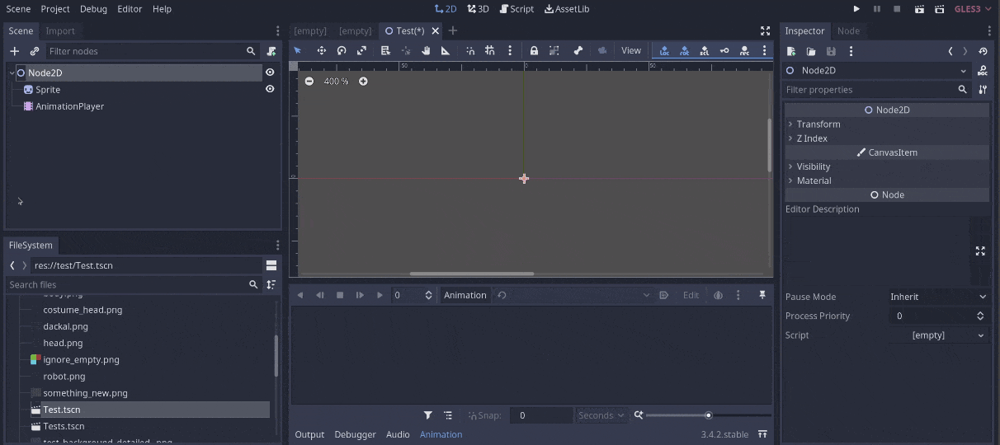

# Godot Aseprite Wizard (Godot 4)

Godot plugin to help import Aseprite animations to AnimationPlayers, AnimatedSprites 2D/3D and SpriteFrames.

_This branch supports Godot 4. For Godot 3 docs and code check the [godot_3](https://github.com/viniciusgerevini/godot-aseprite-wizard/tree/godot_3) branch. You can find more details about the differences between Godot 3 and Godot 4 on issue https://github.com/viniciusgerevini/godot-aseprite-wizard/issues/70._

_Check the screenshots folder for more examples._

### Features

- Import animations to AnimationPlayer, AnimatedSprite2D, AnimatedSprite3D or SpriteFrames resource.
- Godot importer and inspector docks for easy import and re-import.
- Filters out layers you don't want in the final animation using regex.
- Supports Aseprite animation directions (forward, reverse, ping-pong, ping-pong reverse).
- Supports loopable and non-loopable animations via Aseprite repeat or tags.
- Separates each Aseprite Tag into animations. In case no tags are defined, imports everything as default animation.
- AnimatedSprite
  - Creates SpriteFrames with Atlas Texture to be used in AnimatedSprites.
  - Converts Aseprite frame duration (defined in milliseconds) to Godot's animation FPS. This way you can create your animation with the right timing in Aseprite and it should work the same way in Godot.
  - Choose to export the Aseprite file as a single SpriteFrames resource or separate each layer in different resources.
  - Adds Aseprite file importer to Godot.
- AnimationPlayer
  - Adds and removes animation tracks without removing other existing tracks.
  - You are free to import multiple files to the same AnimationPlayer or import each layer to their own Sprite/TextureRect and AnimationPlayer.
  - Supports animation libraries.

Aseprite Wizard is only required during development. If you decide to not use it anymore, you can remove the plugin and all animations previously imported should keep working as expected.

## Installation and Configuration

Follow Godot [ installing plugins guide ]( https://docs.godotengine.org/en/stable/tutorials/plugins/editor/installing_plugins.html).

If you are using Windows, a portable version or if the `aseprite` command is not in your PATH, you need to set the right path on `Editor -> Editor Settings -> Aseprite`.

| Configuration           | Description |
| ----------------------- | ----------- |
| General > Command Path | Path to the aseprite executable. Default: `aseprite` |

For project specific configurations check `Project -> Project Settings -> General > Aseprite`.

| Configuration           | Description |
| ----------------------- | ----------- |
| Animation > Layer > Exclusion Pattern | Exclude layers with names matching this pattern (regex). This is the default value for new nodes. It can be changed or removed during the import. Default: not set |
| Animation > Loop > Enabled | Enables animation loop by default. Default: `true` |
| Animation > Loop > Exception prefix | Animations with this prefix are imported with opposite loop configuration. For example, if your default configuration is Loop = true, animations starting with `_` would have Loop = false. The prefix is removed from the animation name on import (i.e  `_death` > `death`). Default: `_` |
| Animation > Storage > Use metadata | (_deprecated_) Persist dock info in the scene metadata instead of editor description. Default: `true` |
| Animation > Storage > Enable metadata removal on export | Removes dock metadata from scene when exporting the project. Ensures no local info is shipped with the app. Default: `true` |
| Import > Preset > Enable Custom Preset | Enable Custom preset properties (*requires plugin restart*). Default: `false`. |
| Import > Preset > Preset | Custom preset properties for texture files imported via this plugin. Default: same as Godot's defaults. |
| Import > Cleanup > Remove Json File | Remove temporary `*.json` files generated during import. Default: `true` |
| Import > Cleanup > Automatically Hide Sprites Not In Animation | Default configuration for AnimationPlayer option to hide Sprites when not in animation. Default: `false` |
| Import > Import Plugin > Default Automatic Importer | Which importer to use by default for aseprite files. Options: `No Import`, `SpriteFrames`. Default: `No Import` |
| Wizard > History > Cache File Path | Path to file where history data is stored. Default: `res://.aseprite_wizard_history` |
| Wizard > History > Keep One Entry Per Source File | When true, history does not show duplicates. Default: `false` |

## How to use

_Check this video for usage examples:_ https://youtu.be/1W-CCbrzG_0

After activating the plugin, you can find a section called Aseprite in the inspector dock when selecting Sprite and AnimatedSprite nodes. Also, the importer will be enabled allowing Aseprite files to be used seamlessly. In addition to that, you can find the wizard screen on `Project -> Tools -> Aseprite Spritesheet Wizard` menu.

### AnimationPlayer

Animations can be imported to AnimationPlayers via the Inspector dock.

- First, Create a `Sprite` or `TextureRect` node in your scene.
- With the node selected, look for the "Aseprite" section in the bottom part of the Inspector.
- Fill up the fields and click import.

| Field                   | Description |
| ----------------------- | ----------- |
| Aseprite File | (\*.aseprite or \*.ase) source file. |
| Animation Player |AnimationPlayer node where animations should be added to.|
| Layer | Aseprite layer to be used in the animation. By default, all layers are included. |
| Output folder | Folder to save the sprite sheet (png) file. Default: same as scene |
| Output file name | Output file name for the sprite sheet. In case the Layer option is used, this is used as file prefix (e.g prefix_layer_name.res). If not set, the source file basename is used.|
| Exclude pattern | Do not export layers that match the pattern defined. i.e `_draft$` excludes all layers ending with `_draft`. Uses Godot's [Regex implementation](https://docs.godotengine.org/en/stable/classes/class_regex.html) |
| Keep manual animation length | When this is active the animation length won't be adjusted if other properties were added and the resulting imported animation is shorter. Default: false. |
| Only visible layers | If selected, it only includes in the image file the layers visible in Aseprite. If not selected, all layers are exported, regardless of visibility.|
| Hide unused sprites | If selected, sprites that are present in the AnimationPlayer will be set as visible=false in any animation they are not part of.|

Notes:
- The generated sprite sheet texture is set to the Sprite node and every tag in the Aseprite file will be inserted as an Animation into the selected AnimationPlayer.
- If the animation already exists in the AnimationPlayer, all existing tracks are kept. Only the required tracks for the Sprite animation will be changed.
- Loop configuration and animation length will be changed according to the Aseprite file. If you wish to keep a manually configured animation length, set the `Keep manual animation length` option.
- The plugin will never delete an Animation containing other tracks than the ones used by itself. In case the animation is removed from Aseprite, it will delete the track from the AnimationPlayer and only delete the animation in case there are no other tracks left.
- Animations are added to the global animation library by default. To define a library name, use the `library_name/animation_name` pattern on your Aseprite tags.

### AnimatedSprite and SpriteFrames

There are a few different ways to import animations to be used in AnimatedSprites. All of them create a SpriteFrames resource with everything configured.

#### via Inspector dock

This is very similar to the AnimationPlayer option.

- First, select the AnimatedSprite in your scene.
- With the node selected, look for the "Aseprite" section in the bottom part of the Inspector.
- Fill up the fields and click import.

| Field                   | Description |
| ----------------------- | ----------- |
| Aseprite File: | (\*.aseprite or \*.ase) source file. |
| Animation Player: |AnimationPlayer node where animations should be added to.|
| Layer: | Aseprite layer to be used in the animation. By default, all layers are included. |
| Output folder: | Folder to save the sprite sheet (png) file. Default: same as scene |
| Output file name | Output file name for the sprite sheet. In case the Layer option is used, this is used as the file prefix (e.g prefix_layer_name.res). If not set, the source file basename is used.|
| Exclude pattern: | Do not export layers that match the pattern defined. i.e `_draft$` excludes all layers ending with `_draft`. Uses Godot's [Regex implementation](https://docs.godotengine.org/en/stable/classes/class_regex.html) |
| Only visible layers | If selected, it only includes in the image file the layers visible in Aseprite. If not selected, all layers are exported, regardless of visibility.|

Notes:
- A SpriteFrames resource will be generated and assigned to the AnimatedSprite. This resource is embedded in the scene. It does not require any external dependency.
- As opposed to the AnimationPlayer flow, a new SpriteFrames resource is generated on every import. This means any manual change will be lost after re-import.

### Wizard (bottom dock)

The wizard screen allows you to import SpriteFrames resources without attaching them to a scene or node This can be used in cases where you would like to generate SpriteFrames independently and include them in different nodes manually or programmatically.

| Field                   | Description |
| ----------------------- | ----------- |
| Aseprite File Location: | \*.aseprite or \*.ase source file containing animations. |
| Output folder:          | Folder to save the output `SpriteFrames` resource(s). |
| Output filename / prefix | Defines output filename. In case layers are split into multiple files, this is used as the file prefix (e.g prefix_layer_name.res). If not set, the source file basename is used.|
| Exclude layers matching pattern: | Do not export layers that match the pattern defined. i.e `_draft$` excludes all layers ending with `_draft`. Uses Godot's [Regex implementation](https://docs.godotengine.org/en/stable/classes/class_regex.html)  |
| Split layers in multiple resources: | If selected, each layer will be exported as a separated resource (e.g my_layer_1.res, layer_name_2.res, ...). If not selected, all layers will be merged and exported as a single resource file with the same base name as the source. |
| Only include visible layers | If selected, it only includes in the image file the layers visible in Aseprite. If not selected, all layers are exported, regardless of visibility.|
| Do not create resource file | Does not create SpriteFrames resource. Useful if you are only interested in the .json and .png output from Aseprite. |

Notes:
- Overwrites any manual change done to previously imported resources.

### Importer

If you use the importer flow, any `*.ase` or `*.aseprite` file saved in the project will be automatically imported as a `SpriteFrames` resource, which can be used in `AnimatedSprite` nodes. You can change import settings for each file in the Import dock.

By default, the automatic importer won´t generate any file. You can change the default importer behaviour via Project Settings.

### SpriteFrames importer Options

| Field                   | Description |
| ----------------------- | ----------- |
| Output filename / prefix | Defines output filename. In case layers are split into multiple files, this is used as file prefix (e.g prefix_layer_name.res). If not set, the source filename is used.|
| Exclude layers matching pattern: | Do not export layers that match the pattern defined. i.e `_draft$` excludes all layers ending with `_draft`. Uses Godot's [Regex implementation](https://docs.godotengine.org/en/stable/classes/class_regex.html)  |
| Split layers in multiple resources: | If selected, each layer will be exported as a separated resource (e.g my_layer_1.res, layer_name_2.res, ...). If not selected, all layers will be merged and exported as a single resource file with the same base name as the source. |
| Only include visible layers | If selected it only includes in the image file the layers visible in Aseprite. If not selected, all layers are exported, regardless of visibility.|

## F.A.Q. and limitations

### What is the correct command to use in Aseprite Command Path

The plugin uses `aseprite` as the default command. In case your system uses a different location you can either add it to the PATH variable or provide the full path to the executable. Here are some common locations:

- Steam on Windows: `C:\\Steam\steamapps\common\Aseprite\aseprite.exe`. (This will vary depending on your Steam Library location).
- MacOS: `/Applications/Aseprite.app/Contents/MacOS/aseprite`.
- Ubuntu: `/usr/bin/aseprite`. (Note: usually your PATH already includes binaries from `/usr/bin`)

*Note: Adding Aseprite to the PATH on Windows does not always work, as reported by some users. In this case, it's better to stick to the full path.*

### Non-looping animations

From Aseprite 1.3 you can control loops by setting the `repeat` property under `Tag properties` in Aseprite. There's no extra steps required in the plugin.

Older versions have no option for loops so this plugin handles that via a configured convention.

By default, all animations are imported with loop = true. Any animation starting with `_` (the exception prefix), will be imported with loop = false.

Both the default configuration and the exception prefix can be changed in the configuration window.

### Import overwrite previous files

Currently, import overwrites previously imported files. Any manual modification in the previous resource file will be lost.

### What is the gibberish in the node's "Editor Description"

If you imported animations via the inspector dock before version v5.2.0, you may find some "gibberish" text in the Editor Description field. This is a base64 encoded config for the options you selected for that node. It is not required for the animation to work, however, it does improve the development flow, as you won't need to fill all information up again when re-importing your animations.

From v5.2.0, this information is stored in the scene metadata and shouldn't be visible anymore. Any previously imported animation will still have the Editor Description info, but it will be moved to the metadata when re-imported again.

You can disable the new behaviour at `Project > Project Settings > General > Animation > Storage > Use metadata`. _Keep in mind this will be deprecated in a next major version._
 
As you can select files from anywhere in your system, there is an export plugin to prevent your local path metadata to be shipped with the game. In case you suspect this is conflicting with other plugins (or if you think you don't need it) you can disable it at `Project > Project Settings > General > Animation > Storage > Enable metadata removal on export`.

## Known Issues

### SpriteFrames dock showing outdated resource

Godot is using the cached resource. Open another SpriteFrame and then re-open the affected one. You should see the newest version.

This issue will only show outdated resources in the editor. When running the project you will always see the newest changes.

### Big files issue (Image width cannot be greater than 16384px)

As per Godot's [docs](https://docs.godotengine.org/en/stable/classes/class_image.html):

> The maximum image size is 16384×16384 pixels due to graphics hardware limitations. Larger images may fail to import.

This plugin exports all animations as a single sprite sheet. If you are using a big canvas size in Aseprite with lots of frames, you may reach this limit.

Sprite sheets are generated using a `packing` algorithm, which should mitigate this issue, however, it won't solve it entirely.

You can workaround the issue by using an `AnimationPlayer` and splitting your animations in multiple Aseprite files. By enabling the `Hide unused sprites` option, you can import multiple files to different sprites in the same animation player and only the active one will be visible.

## Contact

Thanks for the constant feedback and suggestions. If you are facing problems with the plugin or have suggestions/questions, please open an issue in this repo.

If you like game dev related content and want to support me, consider subscribing to my [Youtube channel](http://youtube.com/c/ThisIsVini).

Check my [website](https://thisisvini.com) for more contact options.
