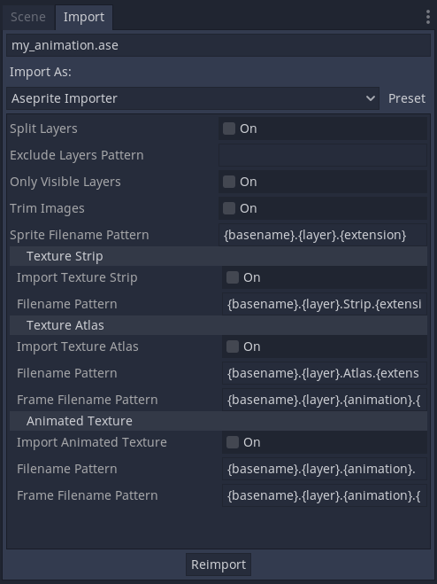
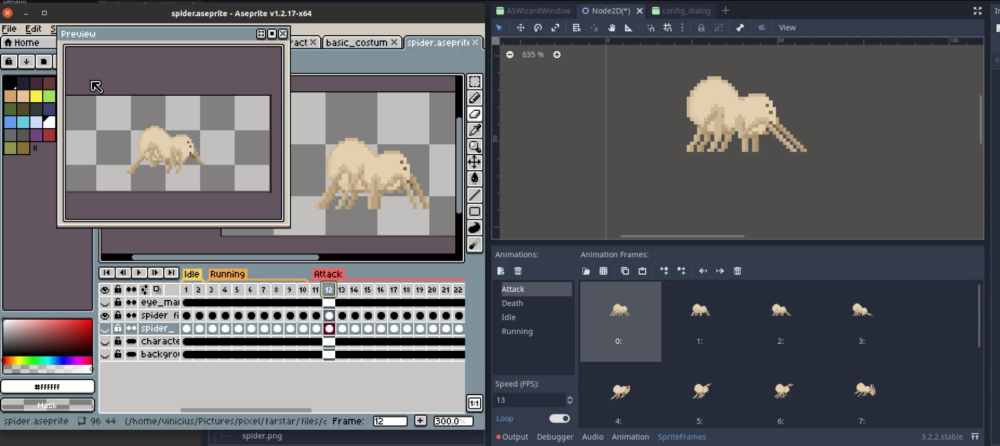

# Godot Aseprite Wizard

Godot plugin to help importing Aseprite animations as SpriteFrames.

This plugin uses Aseprite CLI to generate the spritesheet, and then converts it to SpriteFrames, that can be used in AnimatedSprite node.

It also adds Aseprite importer to Godot, so you can use `*.ase` and `*.aseprite` files directly as resources.

### Features

- Creates SpriteFrames with Atlas Texture to be used in AnimatedSprites.
- Separate each Aseprite Tag as its own animation. In case no tags are defined, import everything as default animation.
- Converts Aseprite frame duration (defined in milliseconds) to Godot's animation FPS. This way you can create your animation with the right timing in Aseprite, and it should work the same way in Godot.
- Choose to export Aseprite file as single SpriteFrames resource, or separate each layer as its own resource.
- Filter out layers you don't want in the final animation, using regex.
- Supports Aseprite animation direction (forward, reverse, ping-pong)
- Adds Aseprite file importer to Godot (check limitations section).
- (Importer only) Suppports importing Aseprite files as SpriteFrames, Atlas Texture, Animated Texture and Texture strip.

## Instalation and Configuration

Follow Godot [ installing plugins guide ]( https://docs.godotengine.org/en/stable/tutorials/plugins/editor/installing_plugins.html).

If you are using Windows, a portable version or if the `aseprite` command is not in your PATH, you need to set the right path on `Project -> Tools -> Aseprite Spritesheet Wizard -> [Configuration button]`.

| Configuration           | Description |
| ----------------------- | ----------- |
| Aseprite Command Path   | Path to the aseprite executable. Default: `aseprite` |
| Enable Aseprite Importer   | Enable/Disable Aseprite automatic importer. Default: `true` |
| Remove Source Files   | Remove `*.json` and `*.png` files generated during import in Wizard. Default: `false` |

## How to use

After activating the plugin, the importer will be enable allowing Aseprite files to be used seamlessly. In addition to that, you can find the wizard screen on `Project -> Tools -> Aseprite Spritesheet Wizard` menu.

### Wizard flow

The wizard screen allows you to import files from outside your project root. This can be used in cases where you prefer to not include your Aseprite files to your project, or you don't want them to be imported automatically.

Check this video to see the wizard in action: https://www.youtube.com/watch?v=Yeqlce685E0 . This video is slightly outdated, but the main features are still the same.

### Importer flow

If you use the importer flow, any `*.ase` or `*.aseprite` file saved in the project will be automatically imported as a `SpriteFrames` resource, which can be used in `AnimatedSprite` nodes. You can change import settings for each file in the Import dock.

__Note: Currently, files created in the importer are bigger than the ones created through the wizard flow__

### Options

| Field                   | Description |
| ----------------------- | ----------- |
| Aseprite File Location: | *.aseprite or *.ase source file containing animations. |
| Output folder:          | Folder to save the output `SpriteFrames` resource(s). |
| Output filename / prefix | Defines output filename. In case layers are split in multiple files, this is used as file prefix (e.g prefix_layer_name.res). If not set, source filename is used.|
| Exclude layers matching pattern: | Do not export layers that match the pattern defined. i.e `_draft$` excludes all layers ending with `_draft`. Uses Godot's [Regex implementation](https://docs.godotengine.org/en/stable/classes/class_regex.html)  |
| Split layers in multiple resource: | If selected, each layer will be exported as a separated resource (e.g my_layer_1.res, layer_name_2.res, ...). If not selected, all layers will be merged and exported as a single resource file with same base name as source.  |
| Only include visible layers | If selected it only includes in the image file the layers visible in Aseprite. If not selected, all layers are exported, regardless of visibility.|
| Trim image | Removes padding from sprites/layers/cels before saving them. |

Wizard-only options:

| Field                   | Description |
| ----------------------- | ----------- |
| Do not create resource file | Does not create SpriteFrames resource. Useful if you are only interested in the .json and .png output from Aseprite. |

Importer-only options:

| Field                   | Description |
| ----------------------- | ----------- |
| Sprite filename pattern | Defines output filename. Default value: `{basename}.{layer}.{extension}` |
| Import texture strip | Creates image strip (png) per sprite/layer. Default value: `false` |
| Texture Strip Filename Pattern | Name for image strip file. Default value: `{basename}.{layer}.Strip.{extension}` |
| Import Texture Atlas | Creates AtlasTexture per animation, along with textures for each animation frame. Default value: false |
| Texture Atlas Filename Pattern | Name for AtlasTexture files. Default value: `{basename}.{layer}.Atlas.{extension}` |
| Texture Atlas Frame Filename Pattern | Name for AtlasTexture frames files. Default value: `{basename}.{layer}.{animation}.{frame}.Atlas.{extension}` |
| Import Animated Texture | Creates one AnimatedTexture for each animation. Default value: `false` |
| Animated Texture Filename Pattern | Name for Animated Texture files. Default value: `{basename}.{layer}.{animation}.Texture.{extension}` |
| Animated Texture Frame Filename Pattern | Name for Animated Texture frames files. Default value: `{basename}.{layer}.{animation}.{frame}.Texture.{extension}` |

## F.A.Q. and limitations

### What is the correct command to use in Aseprite Command Path

The plugin uses `aseprite` as default command. In case your system uses a different location you can either add it to the PATH variable or provide the full path to the executable. Here are some common locations:

- Steam on Windows: `C:\\Steam\steamapps\common\Aseprite\aseprite.exe`. (This will vary depending on your Steam Library location).
- MacOS: `/Applications/Aseprite.app/Contents/MacOS/aseprite`.
- Ubuntu: `/usr/bin/aseprite`. (Note: usually your PATH already includes binaries from `/usr/bin`)

### Non-looping animations

Aseprite does not have the concept of Loop / single run animations, as in Godot. Because of that, all animations are imported with Loop on. To disable it, you need to open the resource in the editor and uncheck the loop toggle (it won't work if you are using the importer flow).

Loops are useful for running, walking and idle cycles. Single run is useful for death, attack and engage animations.

### Import overwrite previous files

Currently, import overwrite previous imported files. Any manual modification in the previous resource file will be lost.

### Blurry images when importing through Wizard Screen

The wizard screen uses Godot's default image loader. To prevent blurry images, disable the filter flag for Textures in the Import dock and set it as default preset.

For more info, check: https://docs.godotengine.org/en/3.2/getting_started/workflow/assets/import_process.html

## Known Issues

### SpriteFrames dock showing outdated resource

Godot is using the cached resource. Open another SpriteFrame and then re-open the affected one. You should see the newest version.

This issue will only show outdated resources in the editor. When running the project you will always see the newest changes.

### Files imported by the importer are bigger than the ones imported using the Wizard.

The sprite sheet file (png) used in the resource is created by Aseprite, outside Godot Editor. Because of that, the plugin needs to trigger a file system scan to import this file.

However, the scan operation is asyncronous and it can't be used in the importer. We implemented a fallback method but, unfortunatelly, it creates bigger resource files.

Until we find an alternative way, the importer will create bigger files. If you prefer to stick with the wizard flow, but you save your aseprite files inside your project folder, there is a configuration to disable the automatic importer.
